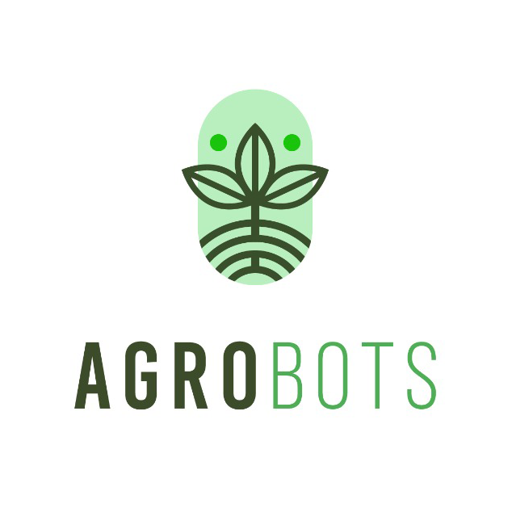

<h2 align='center'>AgroBots</h2>

Sistema proposto para o <b>Global Solution 1º semestre da FIAP 2023</b> para capacitar os agricultores, fornecendo-lhes uma ferramenta poderosa que otimize o manejo agrícola e aumente a produtividade e qualidade das plantações.

 

> ⚠️ Para clonar o repositório você precisará do [Git LFS](https://git-lfs.com)

 

---

 

# Criadores

## Adriano Lombardi

adriano.lombardi@yahoo.com.br

[Linkedin](http://linkedin.com/in/adriano-lombardi-a21a3719)

 

## Alberto Frigatto de Andrade Ferreira

albertofrigatto.comercial@gmail.com

[Linkedin](https://www.linkedin.com/in/alberto-frigatto-de-andrade-ferreira-a72022251/)

[GitHub](https://github.com/Alberto-Frigatto)

 

## Danilo Fernando de Paula e Silva

 

## Gustavo Rodrigues Lopes

guhrlopes999@gmail.com

[Instagram](https://www.instagram.com/gustavo.r.lopes/)

 

## Renato Luís Souza Brandão Júnior

renatojr_designer@outlook.com